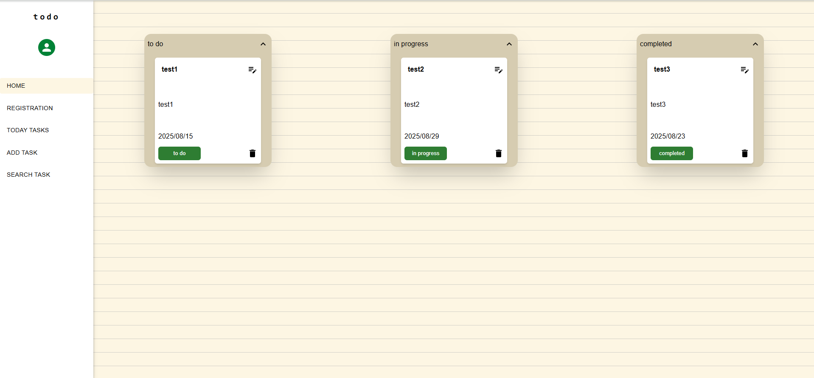
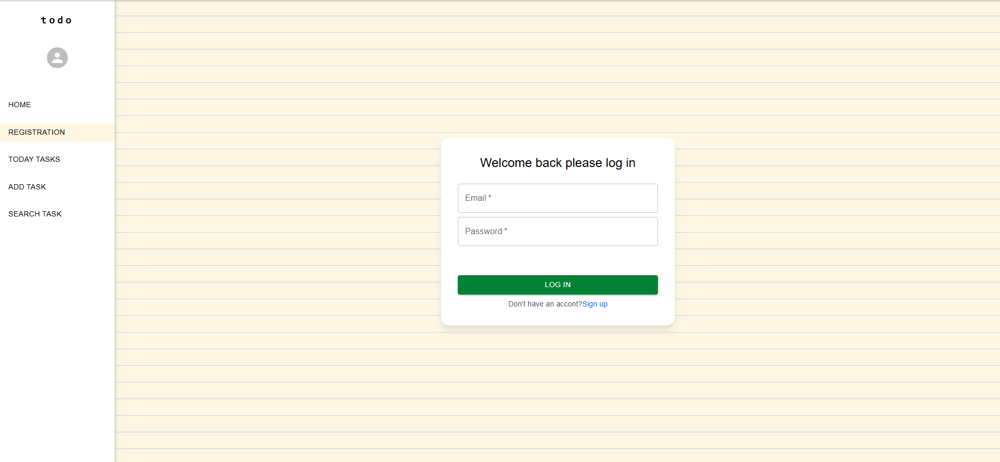
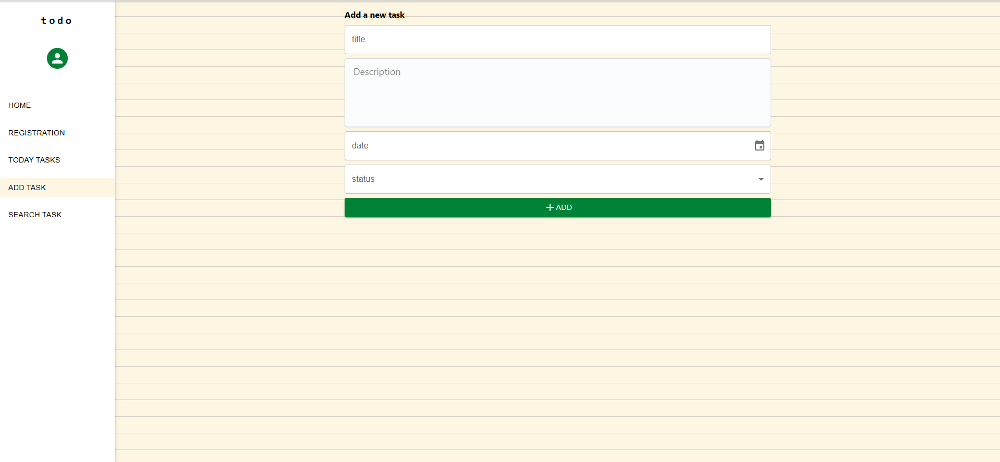
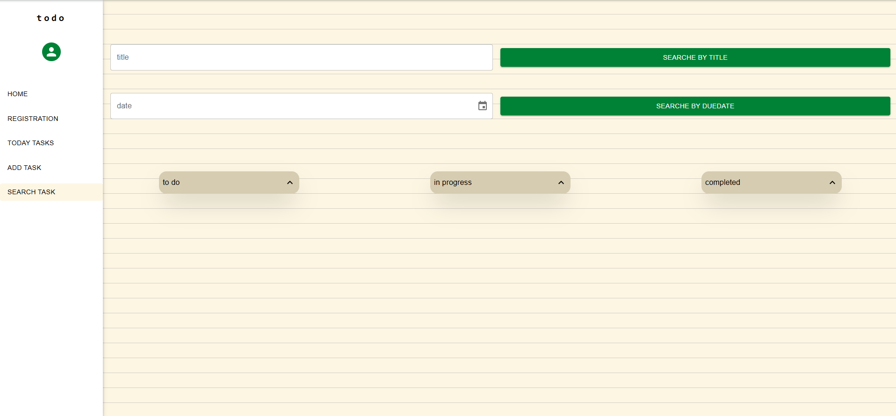

# Task Manager Web Application

A simple task management web application built with React, Vite, Tailwind CSS, and Material UI.
It connects to the Task Manager API and provides a clean, responsive interface for managing your daily tasks.

## ✨ Highlights

- 🔐 Secure login & registration (JWT-based, handled by backend)

- 📝 Manage tasks (create, edit, delete, filter)

- 🎨 Responsive UI with Tailwind + Material UI

- ⚡ Fast development with Vite

- 📡 API communication via Axios

## Tech Stack

- React
- Vite
- Tailwind CSS
- Material UI
- Axios
- uuid
- dayjs
- dotenv

## Screen Shots
- home

- registration

- add task

- search task



## Getting Started

### Prerequisites

- Node.js (v14 or higher recommended)
- npm or yarn
- A running instance of the Task Manager API(https://github.com/arefdm/TodoListProject_BackEnd.git)

### Installation

1. Clone the repository:

   ```
   git clone https://github.com/Sholehghm/TodoListProject_FrontEnd.git
   cd TodoListProject_FrontEnd
   ```

2. Install dependencies:

   ```
   npm install
   # or
   yarn install
   ```

3. Create a .env.development file in the root directory and add the following environment variable:

   ```
   VITE_API_URL= the address of your backend API(for example: http://localhost:5000/   api)
   ```

4. Running the App

   - Start the development server:

   ```
   npm run dev
   # or
   yarn dev
   ```

- The app will be available at:

  ```
  http://localhost:5173
  ```
- To run production server use docker

## 🚀 Running with Docker Compose (Production)

This project includes a docker-compose.yml file to run the frontend, backend together.

Steps:

1. Make sure you have Docker and Docker Compose installed.

2. Clone the frontend repo (this repo).

3. Clone the backend repo (https://github.com/arefdm/TodoListProject_BackEnd.git).

4. Create .env files for both frontend and backend if not already done.

5. put frontend folder and backend folder together in a folder and copy docker-compose to it:
   ```
   root/
       backend/
       frontend/
       docker-compose.yaml
   ```

Run:
```
docker-compose up --build -d
```

Access the app:

Frontend: http://localhost:8080

Backend API: http://localhost:5000

## 🗂 Project Structure

```
src/
  components/   # Reusable UI components
  context/      # Custom context to state management
  utils/        # authentication handling, task API handling
  App.jsx       # Main app component
  main.jsx      # Entry point
```

## 📄 Available Pages

- home — main page to view all tasks and manage them

- Register — Sign up for a new account

- Login — Authenticate to access your tasks

- Today Task — view and mange today tasks

- Search Task — search tasks by their title and due date

- Add Task — Add task


## 🔗 Backend Connection

- JWT is stored in cookies and automatically sent with requests.

- Errors (400, 401, 404, 500) are handled with user-friendly messages.

## 💡 Notes

- Run the backend first before starting this app.